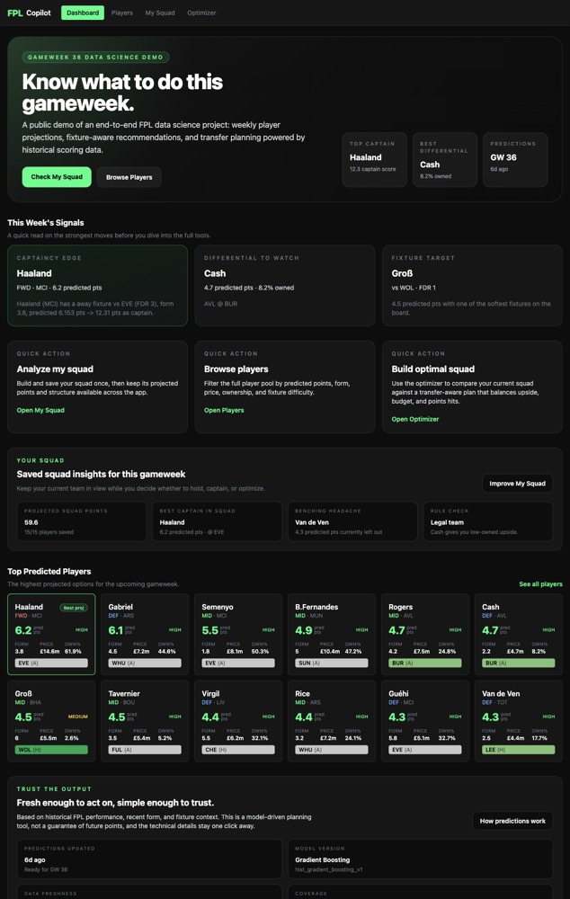
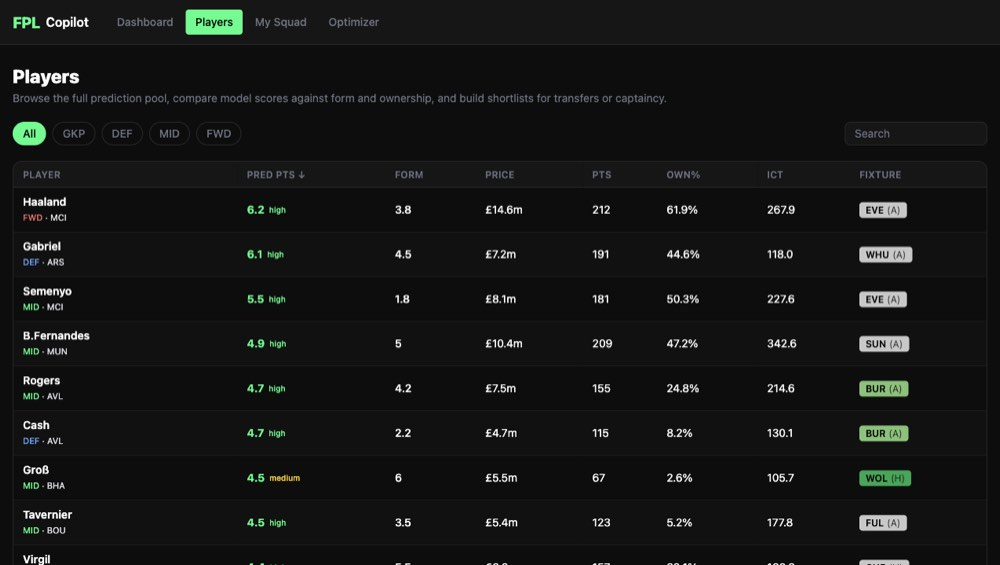
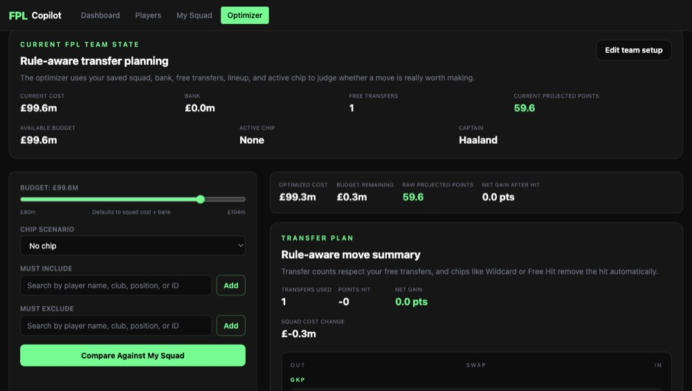
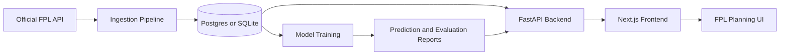

# FPL Copilot

[](https://github.com/NoahF90210/FPL-Copilot/actions/workflows/ci.yml)
[](https://github.com/NoahF90210/FPL-Copilot/actions/workflows/daily-data-refresh.yml)

FPL Copilot is a deployed Fantasy Premier League analytics app that combines model-driven player projections, saved-squad analysis, and transfer-aware optimization.

**Live app:** [fpl-copilot.tech](https://fpl-copilot.tech)

## Why It Matters

Fantasy Premier League decisions are messy: fixtures, ownership, budget, captaincy, bench order, free transfers, and points hits all interact. FPL Copilot turns that into a usable planning workflow:

- ranked player projections for the next gameweek
- fixture-aware captaincy and differential recommendations
- saved squad state across pages
- rule-aware squad validation for real FPL constraints
- optimizer output that compares raw upside against transfer hits
- model freshness and evaluation data surfaced in the UI

## Screenshots

<p>
  
</p>

| Player Predictions | Transfer Optimizer |
|---|---|
|  |  |

## Tech Stack

- `Next.js` and TypeScript frontend
- `FastAPI` backend
- `SQLAlchemy` data layer
- `Postgres` for production data, with local SQLite fallback
- `scikit-learn` Ridge baseline and HistGradientBoostingRegressor model
- `MLflow` experiment tracking
- `PuLP` optimization for squad selection
- Dockerized backend runtime
- GitHub Actions for CI, scheduled ingestion, and model refresh workflows

## Architecture



## Main Product Flows

- **Dashboard:** weekly recommendations, model freshness, and saved squad summary
- **Players:** sortable prediction table with form, ownership, price, ICT, and fixture context
- **My Squad:** saved team builder with FPL squad limits, lineup, captaincy, bench, bank, chip, and free-transfer state
- **Optimizer:** transfer-aware squad comparison that accounts for budget, saved players, free transfers, points hits, and chip scenarios
- **About Model:** recruiter-friendly model explanation, evaluation snapshot, and data freshness status

## Modeling

- **Baseline model:** Ridge regression
- **Main model:** HistGradientBoostingRegressor
- **Features:** position, price, ownership, fixture difficulty, home/away context, rolling points, rolling minutes, rolling BPS, rolling ICT, rolling expected goal involvements, and games played
- **Validation:** time-based validation over recent gameweeks
- **Current tracked metrics:** MAE and RMSE for baseline and gradient boosting models

The backend can serve predictions from the live warehouse when available, or degrade gracefully to saved report artifacts so the demo remains usable.

## API Routes

- `GET /api/players`
- `GET /api/predict`
- `GET /api/model-status`
- `POST /api/optimize`
- `GET /api/differentials`
- `GET /api/captain`
- `GET /api/squad/{team_id}`
- `GET /api/backtest`
- `GET /health`

## Local Run

From the repo root:

```bash
npm run app:start
```

This starts the backend on `http://127.0.0.1:8000` and the frontend on `http://127.0.0.1:3000`.

## Local Data And Training

The backend scripts support both the configured warehouse and a local SQLite fallback. Use the local fallback when you want a quick run without depending on the remote database:

```bash
backend/venv/bin/python backend/scripts/init_db.py --use-local-db
backend/venv/bin/python backend/scripts/run_pipeline.py --use-local-db
backend/venv/bin/python backend/scripts/train_model.py --use-local-db
```

If the configured warehouse is unreachable, the scripts fail with a clear message and point you to `--use-local-db`.

## Verification

Backend:

```bash
backend/venv/bin/python -m pytest backend/tests/test_config.py backend/tests/test_database_repository.py backend/tests/test_optimizer.py
```

Frontend:

```bash
cd frontend && npm run build
```

CI runs the same focused backend tests and frontend production build on pushes and pull requests.

## Deployment

This project uses a split deployment:

- deploy the `frontend` app separately
- deploy the FastAPI backend from `backend/Dockerfile`
- set `NEXT_PUBLIC_API_URL` to the deployed backend URL
- restrict backend CORS with `ALLOWED_ORIGINS`
- verify the frontend app and proxied API routes before sharing

Use `DEPLOYMENT_CHECKLIST.md` before sharing or updating the public link.

## Notes

- Production env examples are included in `frontend/.env.production.example` and `backend/.env.production.example`.
- Scheduled GitHub Actions refresh the FPL data and retrain the model.
- The public demo is designed to stay readable even when live storage is unavailable by falling back to local report artifacts.
