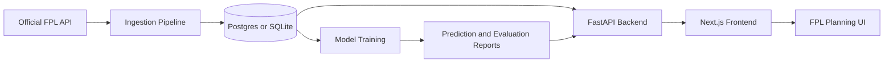

# FPL Copilot

[](https://github.com/NoahF90210/FPL-Copilot/actions/workflows/ci.yml)
[](https://github.com/NoahF90210/FPL-Copilot/actions/workflows/daily-data-refresh.yml)

FPL Copilot turns Fantasy Premier League data into a deployed weekly decision workspace for captaincy, squad analysis, player research, and transfer-aware optimization.

**Live app:** [fpl-copilot.tech](https://fpl-copilot.tech)  
**Source / Repository:** [https://github.com/NoahF90210/FPL-Copilot](https://github.com/NoahF90210/FPL-Copilot)  
**Best 30-second path:** open the dashboard, scan this week's captain/differential/fixture signals, sort the player browser by predicted points, open My Squad to see rule-aware lineup/captaincy planning, then run the Optimizer to compare transfer moves after hits.

## Portfolio Snapshot

| Area | Snapshot |
|---|---|
| Product | Deployed Next.js + FastAPI FPL planning app |
| User problem | Weekly FPL choices require trading off points upside against budget, transfer limits, positions, fixtures, ownership, and points hits |
| Data | Official FPL data, player prices, positions, ownership, form, minutes, ICT/BPS-style signals, fixture context, and saved prediction artifacts |
| Modeling | Ridge baseline and `HistGradientBoostingRegressor` model with time-based validation over gameweeks 31-35 |
| Latest tracked evaluation | Gradient Boosting MAE `0.947`, RMSE `1.871`; Ridge baseline MAE `0.990`, RMSE `1.890` |
| Product workflow | Dashboard recommendations -> player research -> saved squad analysis -> transfer-aware optimizer -> model status check |
| Reliability | API attempts live database reads and falls back to saved report artifacts when storage is unavailable |
| Visual status | Production PNG screenshots live in `docs/screenshots/` (see **Screenshots**); optional GIF still TODO |

## 30-Second Demo Path

1. Open [fpl-copilot.tech](https://fpl-copilot.tech) and read **This Week's Signals** for captaincy, differentials, and fixture targets.
2. Click **Players** and sort/filter by predicted points, position, price, ownership, form, ICT, and fixture difficulty.
3. Click **My Squad** to build a 15-player squad, validate FPL rules, set the XI, captain, vice-captain, bench, bank, free transfers, and chip mode.
4. Click **Optimizer** to compare the saved team against an optimized squad, including budget, must-include/exclude players, free transfers, chips, and points hits.
5. Click **How predictions work** from the dashboard to see the model inputs, freshness status, and evaluation snapshot.

## Why This Matters

Fantasy Premier League is a constrained decision-making problem, not a simple "pick the highest projected player" problem. Useful recommendations need to account for budget, transfer limits, position quotas, fixture difficulty, ownership leverage, captaincy upside, bench order, chips, and the cost of extra transfers.

FPL Copilot turns those constraints into a usable planning workflow:

- ranked player projections for the next gameweek
- fixture-aware captaincy and differential recommendations
- saved squad state across pages
- rule-aware squad validation for real FPL constraints
- optimizer output that compares raw upside against transfer hits
- model freshness and evaluation data surfaced in the UI

## Project Story

**Problem:** FPL managers make weekly decisions under uncertainty and hard constraints: budget, squad composition, transfer counts, fixtures, captaincy, ownership, and points hits all interact.

**Data:** The backend ingests and serves FPL player data, prices, teams, positions, form, ownership, fixture context, and generated prediction reports. The app can use a live database or saved report artifacts for a reliable public demo.

**Modeling approach:** The project compares a Ridge baseline against a gradient boosting model. The latest stored evaluation uses time-based validation across gameweeks 31-35 and tracks MAE/RMSE without claiming leaderboard performance.

**Product workflow:** The frontend packages model output into a decision flow: scan weekly recommendations, research players, save a squad, validate legal team structure, and run the optimizer against realistic transfer constraints.

**Result:** A deployed full-stack data product where a recruiter can click the live app, see model-backed recommendations, inspect the model status, and understand how predictions become user-facing decisions.

**Limitations:** FPL outcomes are noisy and affected by late injuries, rotation, tactical changes, and incomplete future information. Current metrics are point-prediction errors from held-out gameweeks, not proof of real-money betting value or guaranteed rank improvement.


## Tech Stack

- `Next.js` and TypeScript frontend
- `FastAPI` backend
- `SQLAlchemy` data layer
- `Postgres` for production data, with local SQLite fallback
- `scikit-learn` Ridge baseline and HistGradientBoostingRegressor model
- `MLflow` experiment tracking
- `PuLP` optimization for squad selection
- Dockerized backend runtime
- GitHub Actions for CI, scheduled ingestion, and model refresh workflows

## Architecture



## Main Product Flows

- **Dashboard:** weekly recommendations, model freshness, and saved squad summary
- **Players:** sortable prediction table with form, ownership, price, ICT, and fixture context
- **My Squad:** saved team builder with FPL squad limits, lineup, captaincy, bench, bank, chip, and free-transfer state
- **Optimizer:** transfer-aware squad comparison that accounts for budget, saved players, free transfers, points hits, and chip scenarios
- **About Model:** recruiter-friendly model explanation, evaluation snapshot, and data freshness status

## Modeling

- **Baseline model:** Ridge regression
- **Main model:** HistGradientBoostingRegressor
- **Features:** position, price, ownership, fixture difficulty, home/away context, rolling points, rolling minutes, rolling BPS, rolling ICT, rolling expected goal involvements, and games played
- **Validation:** time-based validation over recent gameweeks
- **Current tracked metrics:** MAE and RMSE for baseline and gradient boosting models
- **Latest saved report:** Gradient Boosting MAE `0.947`, RMSE `1.871`; Ridge baseline MAE `0.990`, RMSE `1.890`; `20,704` training rows and `3,951` validation rows in `backend/reports/latest_evaluation.json`

The backend can serve predictions from the live warehouse when available, or degrade gracefully to saved report artifacts so the demo remains usable.

## API Routes

- `GET /api/players`
- `GET /api/predict`
- `GET /api/model-status`
- `POST /api/optimize`
- `GET /api/differentials`
- `GET /api/captain`
- `GET /api/squad/{team_id}`
- `GET /api/backtest`
- `GET /health`

## Local Run

From the repo root:

```bash
npm run app:start
```

This starts the backend on `http://127.0.0.1:8000` and the frontend on `http://127.0.0.1:3000`.

## Local Data And Training

The backend scripts support both the configured warehouse and a local SQLite fallback. Use the local fallback when you want a quick run without depending on the remote database:

```bash
backend/venv/bin/python backend/scripts/init_db.py --use-local-db
backend/venv/bin/python backend/scripts/run_pipeline.py --use-local-db
backend/venv/bin/python backend/scripts/train_model.py --use-local-db
```

If the configured warehouse is unreachable, the scripts fail with a clear message and point you to `--use-local-db`.

## Verification

Backend:

```bash
backend/venv/bin/python -m pytest backend/tests/test_config.py backend/tests/test_database_repository.py backend/tests/test_optimizer.py
```

Frontend:

```bash
cd frontend && npm run build
```

CI runs the same focused backend tests and frontend production build on pushes and pull requests.

## Deployment

This project uses a split deployment:

- deploy the `frontend` app separately
- deploy the FastAPI backend from `backend/Dockerfile`
- set `NEXT_PUBLIC_API_URL` to the deployed backend URL
- restrict backend CORS with `ALLOWED_ORIGINS`
- verify the frontend app and proxied API routes before sharing

Use `DEPLOYMENT_CHECKLIST.md` before sharing or updating the public link.

## Notes

- Production env examples are included in `frontend/.env.production.example` and `backend/.env.production.example`.
- Scheduled GitHub Actions refresh the FPL data and retrain the model.
- The public demo is designed to stay readable even when live storage is unavailable by falling back to local report artifacts.
